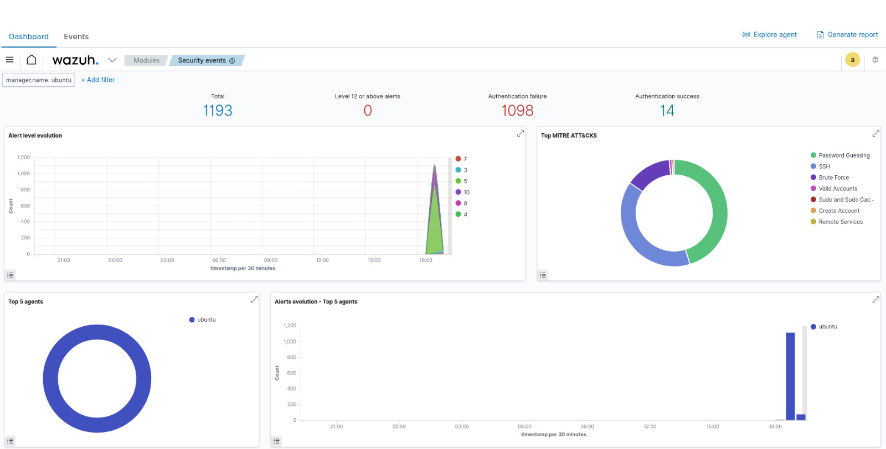
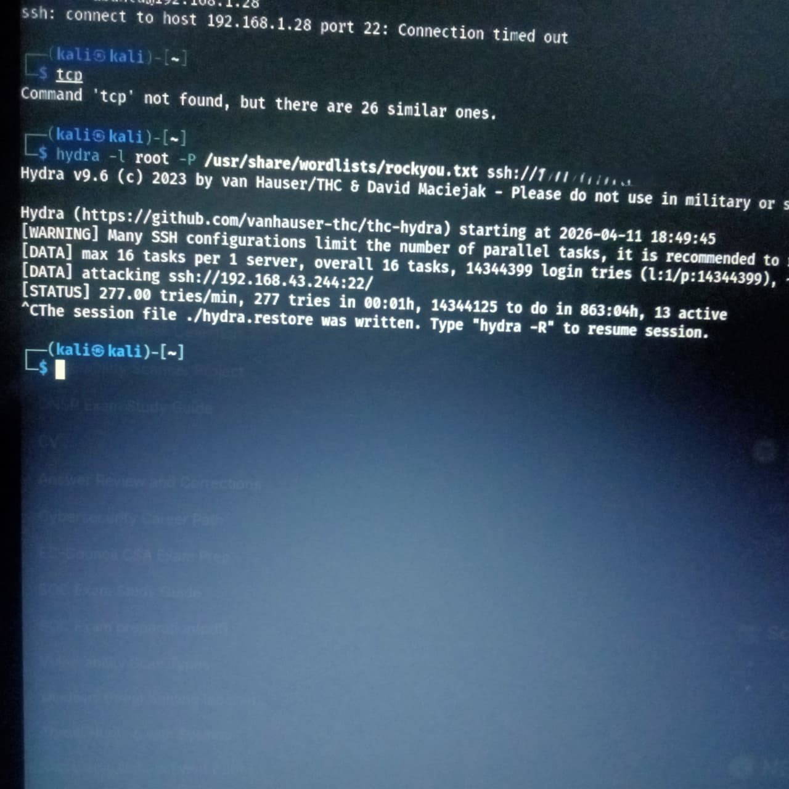
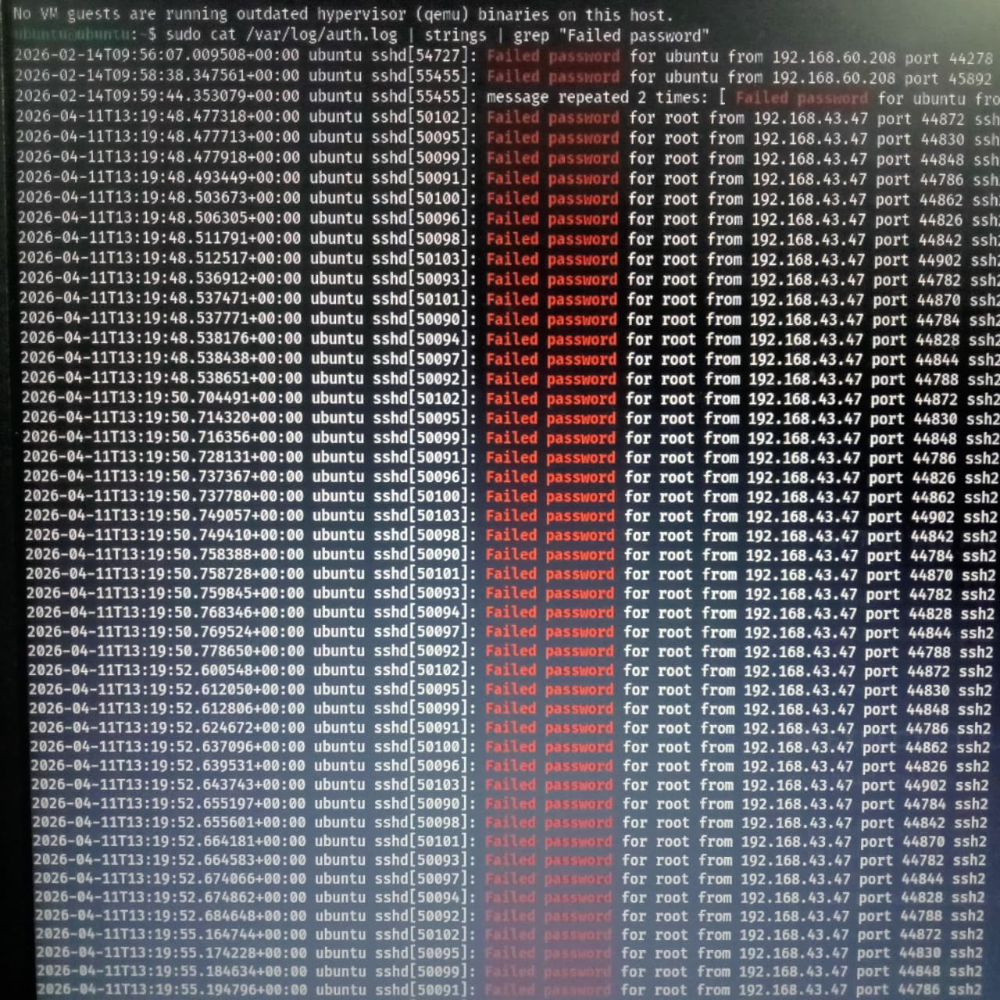
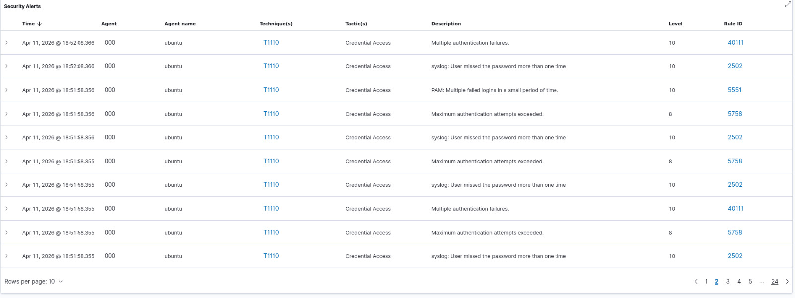

#  Brute Force Attack Simulation & Detection using Wazuh SIEM

 SOC Project | SIEM | Log Analysis | Threat Detection

---

##  Overview

This project demonstrates an end-to-end SOC use case by simulating an SSH brute force attack and detecting it using Wazuh SIEM. It covers attack simulation, log analysis, alerting, and mapping to MITRE ATT&CK.

---

##  Objectives

* Simulate SSH brute force attack
* Monitor authentication logs
* Detect suspicious activity using Wazuh
* Analyze alerts using rule IDs
* Map the attack to MITRE ATT&CK

---

##  Tools & Technologies

* Wazuh SIEM
* Kali Linux (Attacker)
* Ubuntu (Target + Server)
* Hydra (Brute force tool)
* SSH
* Linux logs (`/var/log/auth.log`)

---

##  Lab Architecture

Attacker (Kali) → SSH Attack → Ubuntu → Log Generation → Wazuh → Alert Detection → Dashboard

---

##  Methodology

### 1. Setup

* Installed Wazuh on Ubuntu
* Enabled SSH service

---

### 2. Attack Simulation

```bash
hydra -l root -P /usr/share/wordlists/rockyou.txt ssh://<target-ip>
```

* Generated multiple failed login attempts
* Simulated brute force attack

---

### 3. Log Monitoring

Logs collected from:

```bash
/var/log/auth.log
```

Example:

```bash
Failed password for root from <attacker-ip> port 22 ssh2
```

---

##  Detection using Wazuh

Wazuh detected:

* Repeated failed login attempts
* Authentication activity
* Suspicious login patterns

Alerts included:

* Rule ID
* Source IP
* Log message

---

##  MITRE ATT&CK Mapping

* **Tactic:** Credential Access
* **Technique:** Brute Force (T1110)
* **Sub-technique:** Password Guessing (T1110.001)

This demonstrates how repeated login attempts align with known attacker behavior in real-world SOC environments.

---

##  Rule ID Analysis

The following Wazuh rules were observed during detection:

* **Rule ID 2502** → Authentication-related event (user/session activity)
* **Rule ID 5763** → SSH/PAM authentication log activity
* **Rule ID 40111** → System or authentication monitoring event
* **Rule ID 5551** → User/session activity tracking

These rules help identify:

* Login attempts
* Session behavior
* Authentication patterns

Combined with failed login events, they provide context for detecting brute force attacks.

---

## 📸 Screenshots

### 🔹 Wazuh Dashboard



### 🔹 Brute Force Attack



### 🔹 Log Evidence



### 🔹 Alerts Overview




### 🔹 Alert Details


---

##  Results

* Successfully simulated brute force attack
* Generated multiple authentication logs
* Detected suspicious activity using Wazuh
* Identified attacker behavior through alerts

---

##  Remediation

* Disable root SSH login
* Enforce strong password policies
* Enable firewall-based IP blocking
* Use multi-factor authentication (MFA)

---

##  Limitations

* No automated response implemented
* Limited to SSH brute force attack
* Small lab environment

---

##  Future Improvements

* Implement active response (auto IP blocking)
* Add email alerting
* Extend detection to other attack types

---

##  Conclusion

This project demonstrates how Wazuh SIEM effectively detects brute force attacks using log monitoring and rule-based analysis, reflecting real-world SOC workflows and MITRE ATT&CK alignment.

---
