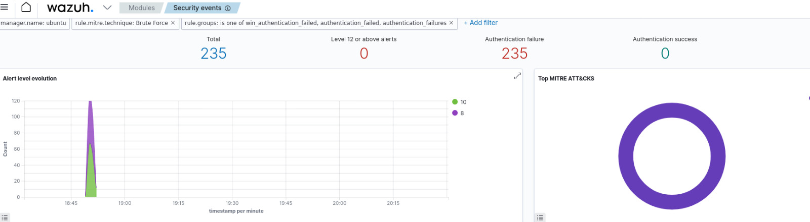
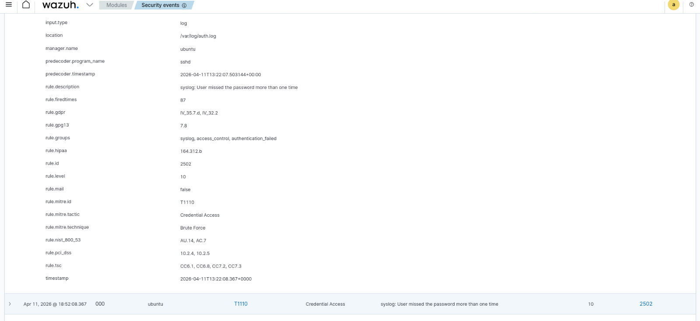
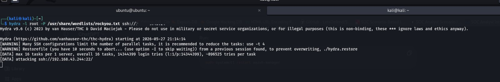
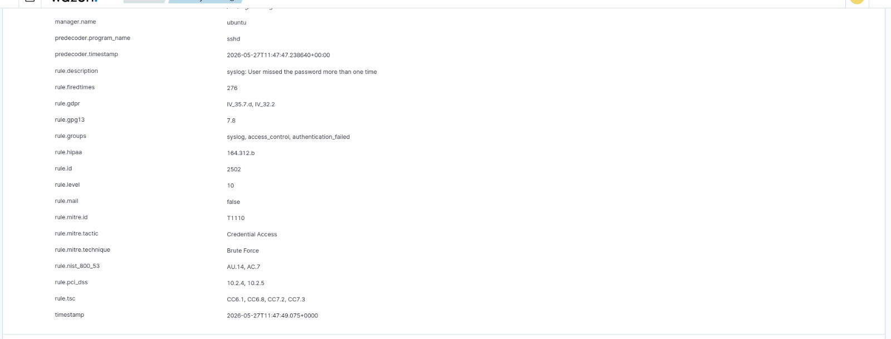
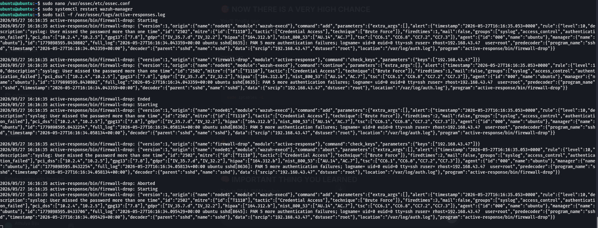

#  Brute Force Attack Simulation & Detection using Wazuh SIEM

 SOC Project | SIEM | Log Analysis | Threat Detection | SOC Workflow

---

##  Overview

This project demonstrates an end-to-end SOC use case by simulating an SSH brute force attack and detecting it using Wazuh SIEM. It covers attack simulation, log analysis, alerting, and mapping to MITRE ATT&CK.

The project initially focused on attack simulation and detection. Later, it was extended by implementing Wazuh Active Response to automate mitigation against suspicious authentication attempts.
---

##  Objectives

* Simulate SSH brute-force attacks in a controlled lab environment
* Monitor authentication logs using Wazuh SIEM
* Detect suspicious login attempts and repeated authentication failures
* Analyze malicious behavior from logs
* Map detections to the MITRE ATT&CK framework
* Implement automated mitigation using Wazuh Active Response
* Understand SOC workflows and incident response processes


---

##  Tools & Technologies

* Wazuh SIEM
* Kali Linux (Attacker)
* Ubuntu (Target + Server)
* Hydra (Brute force tool)
* SSH
* Linux logs (`/var/log/auth.log`)
* Wazuh Active Response
* Firewall / iptables concepts
* MITRE ATT&CK Framework
  
---

##  Lab Architecture

| Component | Purpose |
|---|---|
| Ubuntu Server | Target machine |
| Kali Linux | Attacker machine |
| Wazuh SIEM | Monitoring & detection |
| Hydra | SSH brute-force simulation tool |

---

##  Methodology

### 1. Setup

* Installed Wazuh on Ubuntu
* Enabled SSH service

---

### 2. Attack Simulation

```bash
hydra -l root -P /usr/share/wordlists/rockyou.txt ssh://<target-ip>
```

* Generated multiple failed login attempts
* Simulated brute force attack

---

### 3. Log Monitoring

Logs collected from:

```bash
/var/log/auth.log
```

Example:

```bash
Failed password for root from <attacker-ip> port 22 ssh2
```

---

##  Detection using Wazuh

Wazuh detected:

* Repeated failed login attempts
* Authentication activity
* Suspicious login patterns

Alerts included:

* Rule ID
* Source IP
* Log message

---

##  MITRE ATT&CK Mapping

* **Tactic:** Credential Access
* **Technique:** Brute Force (T1110)
* **Sub-technique:** Password Guessing (T1110.001)

This demonstrates how repeated login attempts align with known attacker behavior in real-world SOC environments.

---

##  Rule ID Analysis

The following Wazuh rules were observed during detection:

* **Rule ID 2502** → Authentication-related event (user/session activity)
* **Rule ID 5763** → SSH/PAM authentication log activity
* **Rule ID 40111** → System or authentication monitoring event
* **Rule ID 5551** → User/session activity tracking

These rules help identify:

* Login attempts
* Session behavior
* Authentication patterns

Combined with failed login events, they provide context for detecting brute force attacks.

---

## 📸 Screenshots

### 🔹 Wazuh Dashboard


### 🔹 Brute Force Attack


### 🔹 Log Evidence


### 🔹 Alerts Overview




### 🔹 Alert Details



---

##  Results

* Successfully simulated brute force attack
* Generated multiple authentication logs
* Detected suspicious activity using Wazuh
* Identified attacker behavior through alerts

---

##  Remediation

* Disable root SSH login
* Enforce strong password policies
* Enable firewall-based IP blocking
* Use multi-factor authentication (MFA)

---

## Active Response & Automated Mitigation

After completing the detection phase, the project was extended using Wazuh Active Response for automated mitigation.

The goal was to automatically trigger a firewall-based response whenever repeated SSH brute-force attempts were detected.

---

## Active Response Configuration
# Open Wazuh configuration file
sudo nano /var/ossec/etc/ossec.conf
## Added Active Response Configuration
<command>
  <name>firewall-drop</name>
  <executable>firewall-drop</executable>
  <timeout_allowed>yes</timeout_allowed>
</command>

<active-response>
  <command>firewall-drop</command>
  <location>local</location>
  <rules_id>2502</rules_id>
  <timeout>600</timeout>
</active-response>
This configuration triggers an automated mitigation action whenever Rule ID 2502 is detected.
---

## Commands Used During Mitigation Setup

# Restart Wazuh Manager
sudo systemctl restart wazuh-manager

# Verify Wazuh Service Status
sudo systemctl status wazuh-manager

## Monitor Active Response Logs
sudo tail -f /var/ossec/logs/active-responses.log
## Active Response Workflow
* Hydra generated repeated SSH login failures
* Ubuntu stored failed authentication attempts inside auth.log
* Wazuh monitored and analyzed the authentication logs
* Rule 2502 triggered after multiple failed login attempts
* Wazuh executed the firewall-drop active response script
* Active response execution was logged inside:
/var/ossec/logs/active-responses.log
---
## Monitoring & Detection
The project involved continuous monitoring of:

* SSH authentication failures
* Suspicious login attempts
* Repeated password guessing behavior
* Authentication log patterns
* Wazuh alert generation
* Active response execution logs
---
## Threat Analysis
The simulated attack represented a brute-force credential attack where an attacker attempts to gain unauthorized access by repeatedly guessing passwords against SSH services.

Indicators observed:

Multiple failed login attempts
Repeated authentication failures from the same source IP
Suspicious authentication patterns
Brute-force behavior detected in logs

---

## Challenges Faced
* Troubleshooting Apache access issues during initial setup
* Understanding Wazuh rule mappings
* Identifying the correct SSH brute-force Rule ID
* Debugging Active Response configuration
* Troubleshooting XML structure issues inside ossec.conf
* Understanding firewall integration behavior
* Monitoring real-time active response logs
  
  ---
 ## Key Learning Outcomes
  
 Through this project, I gained hands-on experience with:

* SIEM monitoring
* Authentication log analysis
* SSH brute-force detection
* Wazuh rule tuning
* MITRE ATT&CK mapping
* Active Response automation
* SOC investigation workflow
* Incident response concepts
* Firewall-based mitigation
* Security event correlation
* Real-world troubleshooting and debugging
  
##  Future Improvements

* Implement custom UFW-based automatic IP blocking
* Add email notifications for alerts
* Integrate Slack/Discord notifications
* Extend detection for web attacks and privilege escalation
* Build real-time SOC dashboards
* Implement advanced threat correlation rules

---

## Screenshots

### 🔹 SSH Brute Force Attack Simulation



### 🔹 Wazuh Detection Alert



### 🔹 Active Response Execution Logs



---


##  Conclusion

This project successfully demonstrated the detection and automated response workflow for SSH brute-force attacks using Wazuh SIEM.

The project helped build practical understanding of SOC operations, security monitoring, log analysis, threat detection, active response configuration, and incident investigation in a real-world style lab environment.

---
